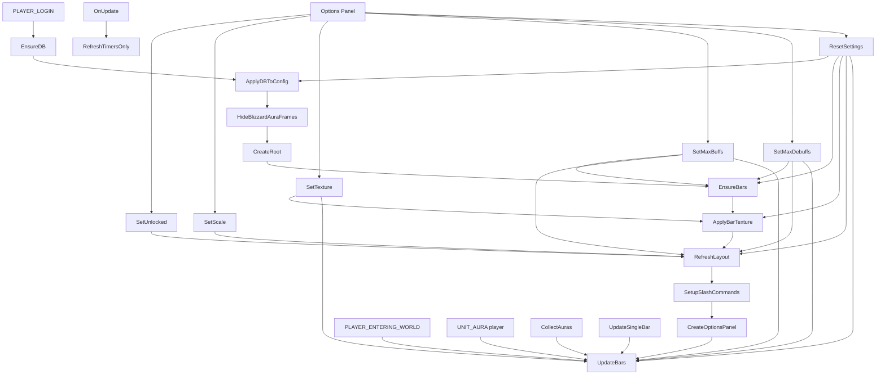

# AuraBars (WoW AddOn)

Addon simples para World of Warcraft (Retail) que substitui a visualização padrão de buffs/debuffs por barras.

## Recursos

- Mostra buffs do jogador em barras com ícone, nome e tempo restante
- Mostra debuffs em barras separadas
- Atualiza o tempo em tempo real
- Permite cancelar buff com botão direito na barra
- Buffs e debuffs em frames independentes (movimentação separada)
- Mostra âncoras visuais de arraste quando destravado
- Aplica borda de destaque em Private Auras (quando o dado estiver disponível)

## Estrutura

- `AuraBars/AuraBars.toc`
- `AuraBars/AuraBars_Config.lua` (configurações e estado persistido)
- `AuraBars/AuraBars_Appearance.lua` (aparência/layout/UI de opções)
- `AuraBars/AuraBars_Behavior.lua` (eventos, leitura de auras e atualização)

## Arquitetura (dev)

### Fluxo de inicialização

1. `PLAYER_LOGIN`
    - `EnsureDB()` carrega/saneia `AuraBarsDB`
    - `ApplyDBToConfig()` aplica limites de barras ao runtime
    - `HideBlizzardAuraFrames()` desativa os frames padrão
    - `CreateRoot()` cria root, headers e âncora de arraste
    - `EnsureBars()` cria barras necessárias
    - `ApplyBarTexture()` aplica textura configurada
    - `RefreshLayout()` aplica escala/posição/layout
    - `SetupSlashCommands()` registra `/aurabar`
    - `CreateOptionsPanel()` registra painel nas opções
    - `UpdateBars()` renderiza estado inicial

2. `PLAYER_ENTERING_WORLD`
    - `UpdateBars()` para garantir sincronização após loading/zonas

3. `UNIT_AURA` (`player`)
    - `UpdateBars()` quando buffs/debuffs mudam

4. `OnUpdate` (tick)
    - `RefreshTimersOnly()` atualiza apenas progresso/tempo das barras visíveis

### Blocos principais

- **Persistência/config**
   - `EnsureDB()`, `ApplyDBToConfig()`, `Clamp()`
- **Layout e movimento**
   - `ApplyRootPosition()`, `RefreshLayout()`, `UpdateMoveAnchorState()`, `CreateRoot()`
- **Dados de aura/render**
   - `CollectAuras()`, `UpdateSingleBar()`, `UpdateBars()`, `RefreshTimersOnly()`
- **Customização visual**
   - `BAR_TEXTURES`, `GetTextureByKey()`, `GetActiveBarTexturePath()`, `ApplyBarTexture()`
- **Configuração do usuário**
   - `SetUnlocked()`, `SetScale()`, `SetTexture()`, `SetMaxBuffs()`, `SetMaxDebuffs()`, `ResetSettings()`
- **UI de opções/comando**
   - `CreateOptionsPanel()`, `OpenOptionsPanel()`, `SetupSlashCommands()`

### Regras de interação

- Clique direito em barra de **buff** tenta cancelar aura (ignora debuff/passivo).
- Âncora verde só aparece com `unlocked = true`.
- O addon usa `C_UnitAuras` (Retail) para leitura de auras.

### Diagrama (Mermaid)

## Instalação

1. Feche o jogo.
2. Copie a pasta `AuraBars` para:
   - Linux (Wine/Proton): `<WoW>/_retail_/Interface/AddOns/`
   - Windows: `<WoW>\_retail_\Interface\AddOns\`
3. Abra o jogo e ative o addon na tela de personagens.

## Observações

- Focado em **Retail** e API moderna (`C_UnitAuras`).

## Comandos

- `/aurabar`: abre a janela de opções

## Janela de opções

- Abra `Esc > Options > AddOns > AuraBars`
- Ajuste lock/unlock, escala, quantidade de buffs/debuffs e textura da barra
- Ajuste também cor e espessura da borda para Private Auras
- Quando destravado, use a âncora de Buffs e a âncora de Debuffs para mover cada frame de forma independente

## Deploy automático no VS Code

- Foi criado o script [scripts/deploy-addon.sh](scripts/deploy-addon.sh)
- Foi criada a task [.vscode/tasks.json](.vscode/tasks.json) com o nome **Deploy AuraBars**
- Foi adicionada a variável de ambiente de projeto em [.env](.env)
- Exemplo para outros ambientes em [.env.example](.env.example)

Como usar:

1. No VS Code, execute `Terminal > Run Task...`
2. Selecione **Deploy AuraBars**
3. A task usa automaticamente `WOW_ADDONS_DIR` do arquivo `.env`

Também é possível rodar manualmente:

- `./scripts/deploy-addon.sh` (usa `.env`)
- `./scripts/deploy-addon.sh "/caminho/World of Warcraft/_retail_/Interface/AddOns"` (sobrescreve o `.env`)
