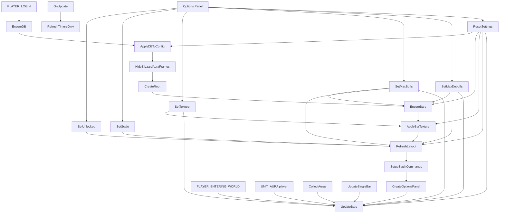

# AuraBars (WoW AddOn)

A simple World of Warcraft (Retail) addon that replaces the default buff/debuff display with bars.

## Features

- Shows player buffs as bars with icon, name, and remaining time
- Shows debuffs in separate bars
- Updates timers in real time
- Allows canceling a buff with right click on the bar
- Buff and debuff frames are independent (moved separately)
- Shows drag anchors when unlocked
- Applies a highlight border for Private Auras (when data is available)
- Supports additional bar textures from LibSharedMedia/SharedMedia when available
- Shows live texture preview in the texture selection area

## Structure

- `AuraBars/AuraBars.toc`
- `AuraBars/AuraBars_Config.lua` (settings and persisted state)
- `AuraBars/AuraBars_Appearance.lua` (appearance/layout and root frames)
- `AuraBars/AuraBars_Options.lua` (options UI and texture picker)
- `AuraBars/AuraBars_Behavior.lua` (events, aura reads, updates)

## Architecture (dev)

### Initialization flow

1. `PLAYER_LOGIN`
    - `EnsureDB()` loads/sanitizes `AuraBarsDB`
    - `ApplyDBToConfig()` applies bar limits to runtime config
    - `HideBlizzardAuraFrames()` disables default Blizzard aura frames
    - `CreateRoot()` creates roots, headers, and drag anchors
    - `EnsureBars()` creates required bars
    - `ApplyBarTexture()` applies selected texture
    - `RefreshLayout()` applies scale/position/layout
    - `SetupSlashCommands()` registers `/aurabar`
    - `CreateOptionsPanel()` registers addon options
    - `UpdateBars()` renders initial state

2. `PLAYER_ENTERING_WORLD`
    - `UpdateBars()` to keep sync after loading/screens/zones

3. `UNIT_AURA` (`player`)
    - `UpdateBars()` whenever buffs/debuffs change

4. `OnUpdate` (tick)
    - `RefreshTimersOnly()` updates only progress/time on visible bars

### Main modules

- **Persistence/config**
   - `EnsureDB()`, `ApplyDBToConfig()`, `Clamp()`
- **Layout and movement**
   - `ApplyRootPosition()`, `RefreshLayout()`, `UpdateMoveAnchorState()`, `CreateRoot()`
- **Aura data/rendering**
   - `CollectAuras()`, `UpdateSingleBar()`, `UpdateBars()`, `RefreshTimersOnly()`
- **Visual customization**
   - `BAR_TEXTURES`, `GetTextureByKey()`, `GetActiveBarTexturePath()`, `ApplyBarTexture()`
- **User configuration**
   - `SetUnlocked()`, `SetScale()`, `SetTexture()`, `SetMaxBuffs()`, `SetMaxDebuffs()`, `ResetSettings()`
- **Options/commands UI**
   - `CreateOptionsPanel()`, `OpenOptionsPanel()`, `SetupSlashCommands()`

### Interaction rules

- Right-click on a **buff** bar attempts to cancel the aura (ignores debuff/passive).
- Drag anchors only show when `unlocked = true`.
- The addon uses `C_UnitAuras` (Retail) to read aura data.

### Diagram (Mermaid)

## Installation

1. Close the game.
2. Copy the `AuraBars` folder to:
   - Linux (Wine/Proton): `<WoW>/_retail_/Interface/AddOns/`
   - Windows: `<WoW>\_retail_\Interface\AddOns\`
3. Open the game and enable the addon on the character selection screen.

## Notes

- Built for **Retail** using the modern API (`C_UnitAuras`).

## Commands

- `/aurabar`: opens the options panel

## Options panel

- Open `Esc > Options > AddOns > AuraBars`
- Configure lock/unlock, scale, buff/debuff bar count, and bar texture
- Configure Private Aura border color and thickness
- When unlocked, use the Buff and Debuff anchors to move each frame independently

## Automatic deploy in VS Code

- Deploy script: [scripts/deploy-addon.sh](scripts/deploy-addon.sh)
- VS Code task: [.vscode/tasks.json](.vscode/tasks.json) named **Deploy AuraBars**
- Project environment variable file: [.env](.env)
- Example environment file: [.env.example](.env.example)

How to use:

1. In VS Code, run `Terminal > Run Task...`
2. Select **Deploy AuraBars**
3. The task automatically uses `WOW_ADDONS_DIR` from `.env`

You can also run manually:

- `./scripts/deploy-addon.sh` (uses `.env`)
- `./scripts/deploy-addon.sh "/path/to/World of Warcraft/_retail_/Interface/AddOns"` (overrides `.env`)
